# mikrotik-dude-icons

> [!NOTE]
> To keep icons consistent and to ensure The Dude support, we don't accept pull requests for icon submissions. If you would like an icon added, please open an issue.

# Example

<p align="center"></p>
<p align="center"></p>

# 📙 Icons List

Here's a list of all the icons currently supported. Feel free to open an issue to suggest icons to add!

### 📦 Icons Pack

|      Icon ID                |                         Icon                                    |
| :-------------------------: | :-------------------------------------------------------------: |
| `aws-site-to-site-vpn-1`    | 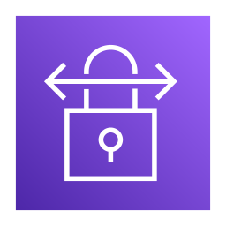      |
| `aws-vpn-1`                 |                    |
| `iconpack-barrier-1`        | 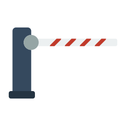          |
| `iconpack-background-1`     | 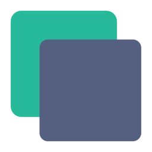       |
| `iconpack-foreground-1`     |        |
| `iconpack-cam-1`            | 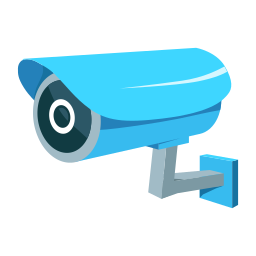              |
| `iconpack-cam-2`            | 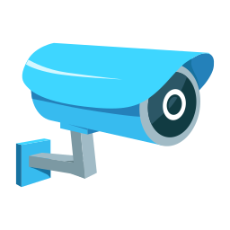              |
| `iconpack-cam-3`            | 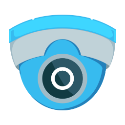              |
| `iconpack-dns-1`            | 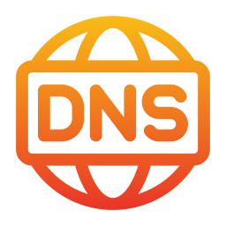              |
| `iconpack-dns-2`            | 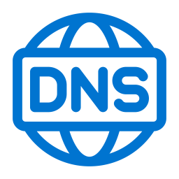              |
| `iconpack-folder-1`         |            |
| `iconpack-folder-backup-1`  | 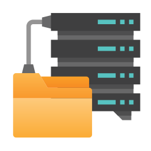    |
| `iconpack-folder-backup-2`  |     |
| `iconpack-folder-share-1`   |      |
| `iconpack-gear-1`           | 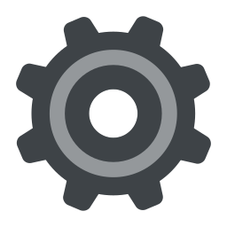             |
| `iconpack-heart-1`          |             |
| `iconpack-net-firewall-1`   | 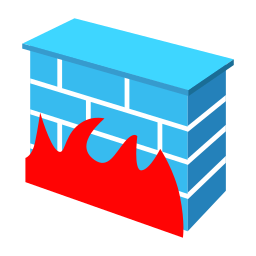     |
| `iconpack-net-hub-1`        | 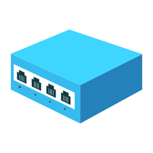          |
| `iconpack-net-monitor-1`    |       |
| `iconpack-net-server-1`     | 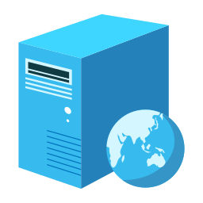       |
| `iconpack-net-server-2`     | 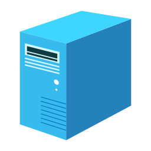       |
| `iconpack-net-swl2-1`       |          |
| `iconpack-net-swl3-1`       | 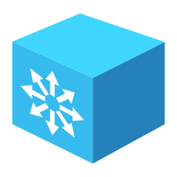         |
| `iconpack-net-unknown-1`    |       |
| `iconpack-terminal-1`       | 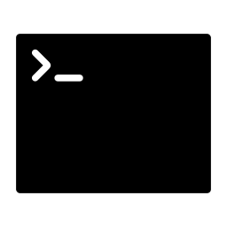         |
| `iot-arduino-1`             |                |
| `iot-homeassistant-1`       | 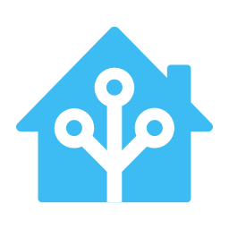         |
| `iot-raspberry-pi-1`        | 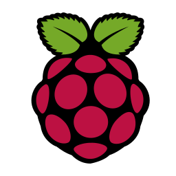          |
| `iot-thermometer-1`         |            |
| `iot-thermometer-2`         |            |
| `iot-thermometer-3`         |            |
| `iot-thermometer-4`         |            |
| `logo-ansible-1`            | 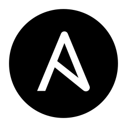              |
| `logo-ansible-2`            | 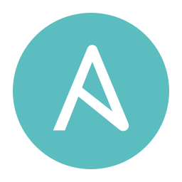              |
| `logo-asterisk-1`           |              |
| `logo-azure-1`              | 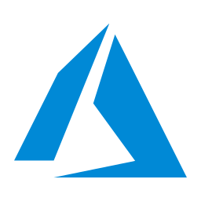                |
| `logo-chrome-1`             |                |
| `logo-digital-ocean-1`      | 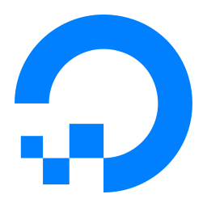        |
| `logo-fortinet-1`           |              |
| `logo-fortinet-2`           |              |
| `logo-github-1`             |                |
| `logo-github-2`             |                |
| `logo-google-1`             |                |
| `logo-grafana-1`            |               |
| `logo-kubernetes-1`         |            |
| `logo-mikrotik-1`           |              |
| `logo-mikrotik-2`           | 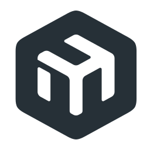             |
| `logo-openvpn-1`            |               |
| `logo-openvpn-2`            |               |
| `logo-openvpn-3`            |               |
| `logo-openvpn-4`            |               |
| `logo-openvpn-5`            |               |
| `logo-paloalto-1`           |              |
| `logo-python-1`             | 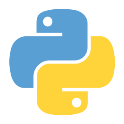               |
| `logo-salesforce-1`         |            |
| `logo-siu-arai-1`           |              |
| `logo-siu-diaguita-1`       |          |
| `logo-siu-guarani-1`        |           |
| `logo-siu-huarpe-1`         |            |
| `logo-siu-kolla-1`          |             |
| `logo-siu-pilaga-1`         |            |
| `logo-siu-sudocu-1`         |            |
| `logo-siu-wichi-1`          |             |
| `logo-the-dude-1`           | 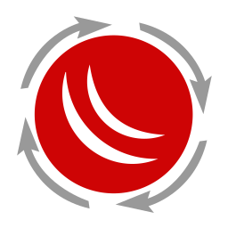             |
| `logo-the-dude-2`           | 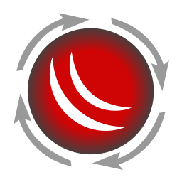             |
| `logo-the-dude-3`           | 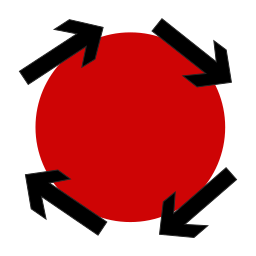             |
| `logo-the-dude-4`           | 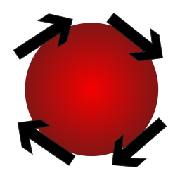             |
| `logo-sap-1`                |                   |
| `logo-ubiquiti-1`           |              |
| `logo-ubiquiti-2`           |              |
| `logo-ubiquiti-3`           |              |
| `logo-ubiquiti-4`           |              |
| `logo-ubiquiti-5`           |              |
| `logo-vmware-1`             |                |
| `logo-wikijs-1`             |                |
| `logo-winbox3-1`            |               |
| `logo-zabbix-1`             |                |
| `os-altlinux-1`             |                |
| `os-debian-1`               | 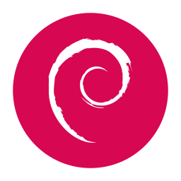                 |
| `os-fedora-1`               |                  |
| `os-kali-1`                 | 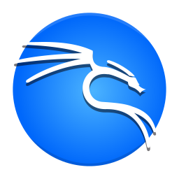                   |
| `os-kubuntu-1`              | 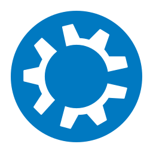                |
| `os-linux-1`                |                   |
| `os-lubuntu-1`              |                 |
| `os-lubuntu-2`              |                 |
| `os-parrotsec-1`            | 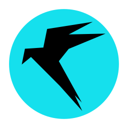              |
| `os-proxmox-1`              |                 |
| `os-proxmox-2`              |                 |
| `os-ubuntu-1`               |                  |
| `os-ubuntu-2`               | 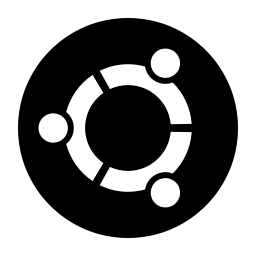                 |
| `os-vyos-1`                 |                    |
| `os-vyos-2`                 |                    |
| `os-vyos-3`                 |                    |
| `os-vyos-4`                 |                    |
| `os-windows-1`              |                 |
| `os-windows-2`              |                 |
| `os-windows-3`              |                 |
| `ui-lbe-1`                  | 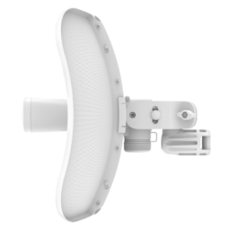                    |
| `ui-lbe-2`                  | 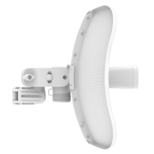                    |
| `ui-liteap-1`               |                  |
| `ui-loco5ac-1`              | 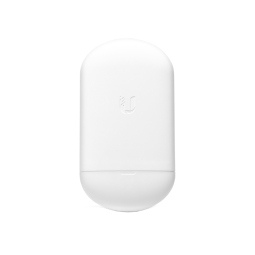                |
| `ui-loco5ac-2`              | 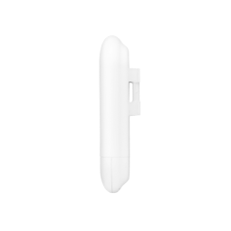                |
| `ui-loco5ac-3`              | 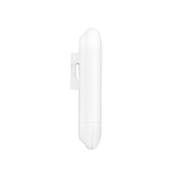                |
| `ui-pbe-1`                  | 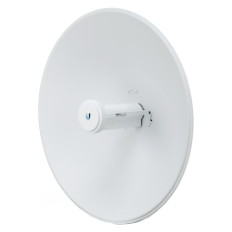                    |
| `ui-pbe-2`                  | 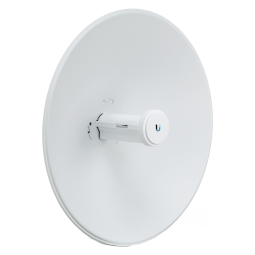                    |
| `ui-pbe-iso-1`              | 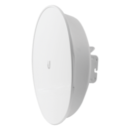                |
| `ui-pbe-iso-2`              | 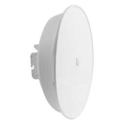                |
| `ui-unifi-uap-1`            |               |
| `ui-unifi-uap-2`            |               |
| `ui-unifi-uap-3`            |               |
| `ui-unifi-uap-edu-1`        |           |

### 📦 WebFig

|      Icon ID                |                         Icon                                    |
| :-------------------------: | :-------------------------------------------------------------: |
| `webfig-configuration-1`    | 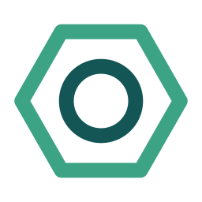      |
| `webfig-dude-1`             | 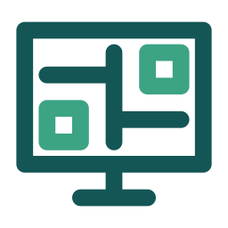               |
| `webfig-files-1`            |               |
| `webfig-graph-1`            |               |
| `webfig-interfaces-1`       | 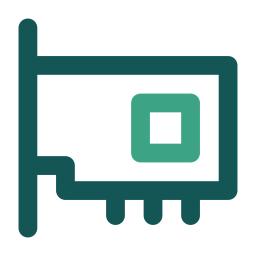         |
| `webfig-iot-1`              |                 |
| `webfig-ipv4-1`             | 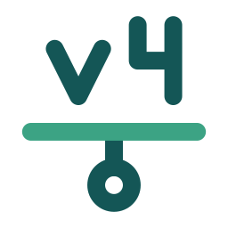               |
| `webfig-ipv6-1`             | 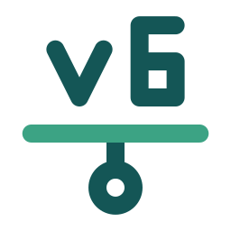               |
| `webfig-log-1`              |                 |
| `webfig-mesh-1`             | 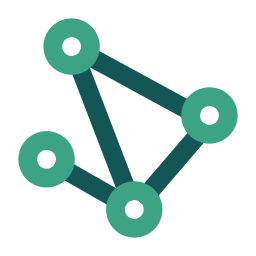               |
| `webfig-mpls-1`             | 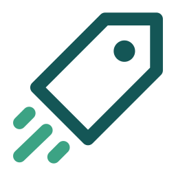               |
| `webfig-nat-1`              | 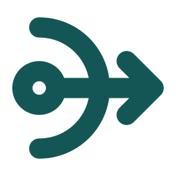                |
| `webfig-ppp-1`              |                 |
| `webfig-queues-1`           |              |
| `webfig-radius-1`           |              |
| `webfig-terminal-1`         |            |
| `webfig-vm-1`               |                  |
| `webfig-wifi-1`             |                |
| `webfig-wireguard-1`        |           |
| `webfig-zerotier-1`         |            |

### 📦 Companies Pack

|      Icon ID                |                         Icon                                    |
| :-------------------------: | :-------------------------------------------------------------: |
| `ips-claro-1`               |                 |
| `ips-claro-2`               |                 |
| `isp-ariu-1`                |                  |
| `isp-ariu-2`                |                  |
| `isp-ariu-3`                |                  |
| `isp-att-1`                 |                   |
| `isp-centurylink-1`         |           |
| `isp-cirion-1`              |                |
| `isp-frontier-1`            |              |
| `isp-gfiber-1`              |                |
| `isp-iplan-1`               |                 |
| `isp-lumen-1`               |                 |
| `isp-movistar-1`            |              |
| `isp-telecentro-1`          |            |
| `isp-telecentro-2`          |            |
| `isp-telecentro-3`          |            |
| `isp-telecom-1`             |               |
| `isp-telecom-2`             |               |
| `logo-aws-1`                |                  |
| `logo-aws-2`                |                  |
| `logo-fortinet-3`           |             |
| `logo-paloalto-2`           |             |
| `logo-hybridnetworks-1`     |       |
| `logo-hybridnetworks-2`     |       |
| `logo-hybridnetworks-3`     |       |
| `logo-hybridnetworks-4`     |       |

---

# 🛠️ Usage

## Web Code Generator

**1.- Open the Web [Code Generator](https://hybridnetworks.github.io/mikrotik-dude-icons/)**

Navigate to the web tool page where you can select your desired icons and generate the corresponding code.

**2.- Set the Installation Directory**

In the "Installation directory of The Dude" input field, enter the desired directory path where the icons will be stored. Examples: `dude`, `slot1-part1/dude`, `sata1/dude-data`, etc.

**3.- Select the Icons**

You can select icons by clicking the checkboxes next to each image. You can also use the "Select All" or "Deselect All" buttons to quickly select or deselect multiple icons. 

You can change the background color of the selected icons using the buttons "Up", "Partial", "Complete", and "Acked" to preview what the icon would look like in The Dude.

**4.- Generate the Code**

Click the "Generate Code" button.

**5.- Copy Code & Download RSC Script & Download Zip**

You can copy the generated code to your clipboard by clicking the "Copy Code" button. If you want to download the generated code as a script file, click the "Download RSC" button. This will create a file named dude-icons.rsc containing the script and save it to your computer. You can also select images and download a zip file, click the "Download ZIP" button.

**Additional Notes**
* Web browser with JavaScript support.
* Internet connection to fetch icons and generate the code.

## Mikrotik RouterOS v7 & CHR

**1.- Set the Global Variable**

Set the global variable with the installation directory of The Dude. Examples: `dude`, `slot1-part1/dude`, `sata1/dude-data`, etc.

```
:global dudeDirectory "sata1/dude-data"
```

**2.- Fetch, Import and Run the Installer**

Fetch the installer script from the specified URL, import and run.

```
/tool fetch url="https://raw.githubusercontent.com/HybridNetworks/mikrotik-dude-icons/main/installer.rsc" mode=https;
import file-name=installer.rsc;
/system/script/run installer;
```

**3.- Clean Up**

Remove the installer script and any global variables used during the installation.

```
/system/script/remove installer;
/system/script/environment/remove dms;
/system/script/environment/remove dudeDirectory;
```

**Additional Notes**

* Ensure you have the necessary permissions to run these commands on your MikroTik device.
* Check the logs for any errors during the installation process to troubleshoot if needed.
* **Don't forget to reboot the system to apply the changes.**

## Mikrotik The Dude 4.0beta3

**1.- Download the ZIP File**

Download the ZIP file from the official repository. Clic [here](https://github.com/HybridNetworks/mikrotik-dude-icons/archive/refs/heads/main.zip).

**2.- Extract the ZIP File**

Extract the ZIP file using a file extraction tool like WinRAR, 7-Zip, or the built-in extraction tools in Windows.

**3.- Copy Files to The Dude Installation Directory**

Copy the extracted files to the installation directory of The Dude.

* Navigate to the extracted folder.
* Select all files and folders in the images directory (Ctrl + A).
* Copy them (Ctrl + C).
* Go to the installation directory: `C:\Program Files (x86)\Dude\data\files\images`.
* Paste the copied files (Ctrl + V) into this directory.

**Additional Notes**

* **Don't forget to restart the service or the system to apply the changes.**

---

# 💖 Support the Project

Thank you so much already for using my projects! If you want to go a step further and support my open source work, buy me a coffee:

### Buy a Coffee (International) :point_down:

[](https://ko-fi.com/hybridnetworks)

[](https://www.buymeacoffee.com/hybridnetworks)

To support the project directly, feel free to open issues for icon suggestions, or contribute with a pull request!


