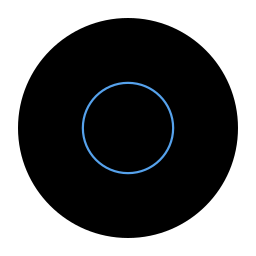

# mikrotik-dude-icons

<h3>NOTE: To keep icons consistent and to ensure The Dude support, we don't accept pull requests for icon submissions. If you would like an icon added, please open an issue.<h3>

# Icons List

Here's a list of all the icons currently supported. Feel free to open an issue to suggest icons to add!

## Icons Pack

|      Icon ID              |                         Icon                                    |
| :-----------------------: | :-------------------------------------------------------------: |
| `iot-thermometer-1`       |            |
| `iot-thermometer-2`       |            |
| `iot-thermometer-3`       |            |
| `iot-thermometer-4`       |            |
| `os-mikrotik-logo-1`      |           |
| `os-mikrotik-logo-2`      |           |
| `os-ubuntu-logo-1`        |             |
| `os-ubuntu-logo-2`        |             |
| `os-vyos-logo-1`          |               |
| `os-vyos-logo-2`          |               |
| `os-vyos-logo-3`          |               |
| `os-vyos-logo-4`          |               |
| `software-openvpn-logo-1` |      |
| `software-openvpn-logo-2` |      |
| `software-openvpn-logo-3` |      |
| `software-openvpn-logo-4` |      |
| `software-openvpn-logo-5` |      |
| `ui-liteap-1`             |                  |
| `ui-litebeam-1`           |                |
| `ui-litebeam-2`           |                |
| `ui-ubiquiti-logo-1`      |           |
| `ui-ubiquiti-logo-2`      |           |
| `ui-ubiquiti-logo-3`      |           |
| `ui-unifi-uap-1`          |               |
| `ui-unifi-uap-2`          |               |
| `ui-unifi-uap-3`          |               |
| `ui-unifi-uap-edu-1`      |           |

## ISPs Pack

|      Icon ID              |                         Icon                                    |
| :-----------------------: | :-------------------------------------------------------------: |
| `ips-aws-logo-1`          |              |
| `ips-aws-logo-2`          |              |
| `ips-claro-logo-1`        |            |
| `ips-claro-logo-2`        |            |
| `isp-ariu-logo-1`         |             |
| `isp-ariu-logo-2`         |             |
| `isp-ariu-logo-3`         |             |
| `isp-cirion-logo-1`       |           |
| `isp-lumen-logo-1`        |            |
| `isp-telecentro-logo-1`   |       |
| `isp-telecentro-logo-2`   |       |
| `isp-telecentro-logo-3`   |       |
| `isp-telecom-logo-1`      |          |
| `isp-telecom-logo-2`      |          |

