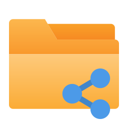
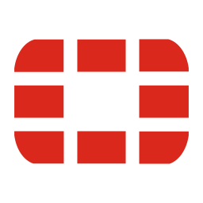
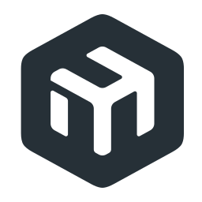
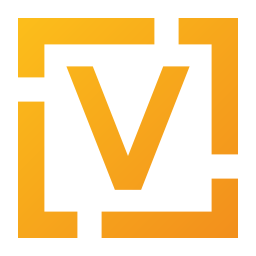
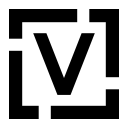

# mikrotik-dude-icons

<h3>NOTE: To keep icons consistent and to ensure The Dude support, we don't accept pull requests for icon submissions. If you would like an icon added, please open an issue.<h3>

# Example

# Icons List

Here's a list of all the icons currently supported. Feel free to open an issue to suggest icons to add!

## Icons Pack

|      Icon ID              |                         Icon                                    |
| :-----------------------: | :-------------------------------------------------------------: |
| `iconpack-background-1`   |        |
| `iconpack-foreground-1`   |        |
| `iconpack-dns-1`          |               |
| `iconpack-dns-2`          |               |
| `iconpack-folder-1`       |            |
| `iconpack-folder-share-1` |      |
| `iconpack-terminal-1`     |          |
| `iot-arduino-1`           |                |
| `iot-homeassistant-1`     |          |
| `iot-raspberry-pi-1`      |           |
| `iot-thermometer-1`       |            |
| `iot-thermometer-2`       |            |
| `iot-thermometer-3`       |            |
| `iot-thermometer-4`       |            |
| `logo-asterisk-1`         |              |
| `logo-azure-1`            |                 |
| `logo-chrome-1`           |                |
| `logo-fortinet-1`         |              |
| `logo-fortinet-2`         |              |
| `logo-google-1`           |                |
| `logo-grafana-1`          |               |
| `logo-mikrotik-1`         |              |
| `logo-mikrotik-2`         |              |
| `logo-openvpn-1`          |               |
| `logo-openvpn-2`          |               |
| `logo-openvpn-3`          |               |
| `logo-openvpn-4`          |               |
| `logo-openvpn-5`          |               |
| `logo-python-1`           |                |
| `logo-salesforce-1`       |            |
| `logo-siu-arai-1`         |              |
| `logo-siu-diaguita-1`     |          |
| `logo-siu-guarani-1`      |           |
| `logo-siu-kolla-1`        |             |
| `logo-siu-pilaga-1`       |            |
| `logo-siu-wichi-1`        |             |
| `logo-sap-1`              |                   |
| `logo-ubiquiti-1`         |              |
| `logo-ubiquiti-2`         |              |
| `logo-ubiquiti-3`         |              |
| `logo-vmware-1`           |                |
| `logo-wikijs-1`           |                |
| `logo-zabbix-1`           |                |
| `os-altlinux-1`           |                |
| `os-debian-1`             |                  |
| `os-lubuntu-1`            |                 |
| `os-lubuntu-2`            |                 |
| `os-kubuntu-1`            |                 |
| `os-proxmox-1`            |                 |
| `os-proxmox-2`            |                 |
| `os-ubuntu-1`             |                  |
| `os-ubuntu-2`             |                  |
| `os-vyos-1`               |                    |
| `os-vyos-2`               |                    |
| `os-vyos-3`               |                    |
| `os-vyos-4`               |                    |
| `os-windows-1`            |                 |
| `os-windows-2`            |                 |
| `os-windows-3`            |                 |
| `ui-lbe-1`                |                     |
| `ui-lbe-2`                |                     |
| `ui-liteap-1`             |                  |
| `ui-loco5ac-1`            |                 |
| `ui-loco5ac-2`            |                 |
| `ui-loco5ac-3`            |                 |
| `ui-pbe-1`                |                     |
| `ui-pbe-2`                |                     |
| `ui-pbe-iso-1`            |                 |
| `ui-pbe-iso-2`            |                 |
| `ui-unifi-uap-1`          |               |
| `ui-unifi-uap-2`          |               |
| `ui-unifi-uap-3`          |               |
| `ui-unifi-uap-edu-1`      |           |

## Companies Pack

|      Icon ID              |                         Icon                                    |
| :-----------------------: | :-------------------------------------------------------------: |
| `ips-claro-1`             |                 |
| `ips-claro-2`             |                 |
| `isp-ariu-1`              |                  |
| `isp-ariu-2`              |                  |
| `isp-ariu-3`              |                  |
| `isp-cirion-1`            |                |
| `isp-lumen-1`             |                 |
| `isp-telecentro-1`        |            |
| `isp-telecentro-2`        |            |
| `isp-telecentro-3`        |            |
| `isp-telecom-1`           |               |
| `isp-telecom-2`           |               |
| `logo-aws-1`              |                  |
| `logo-aws-2`              |                  |

---

## 💖 Support the Project

Thank you so much already for using my projects! If you want to go a step further and support my open source work, buy me a coffee:

#### Buy a Coffee (International) :point_down:

To support the project directly, feel free to open issues for icon suggestions, or contribute with a pull request!